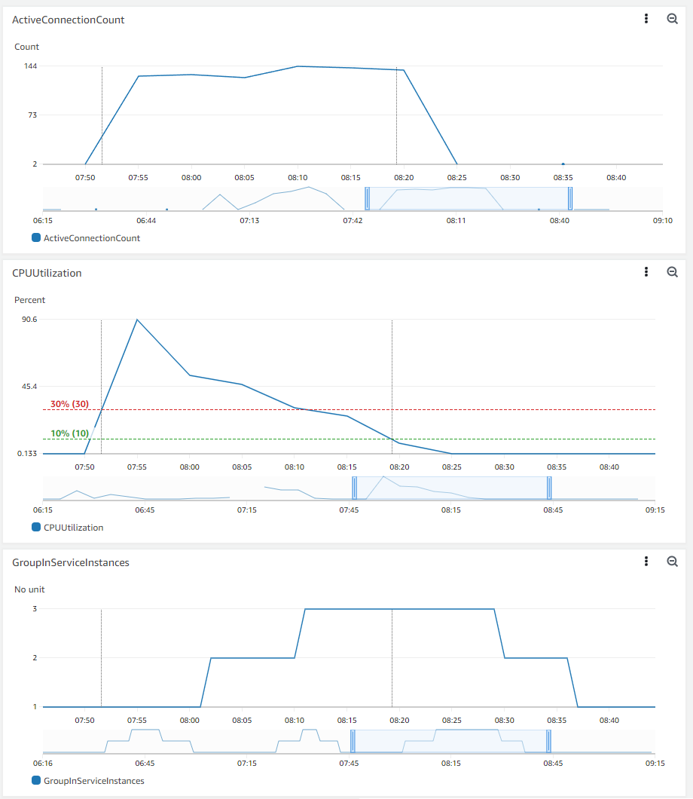
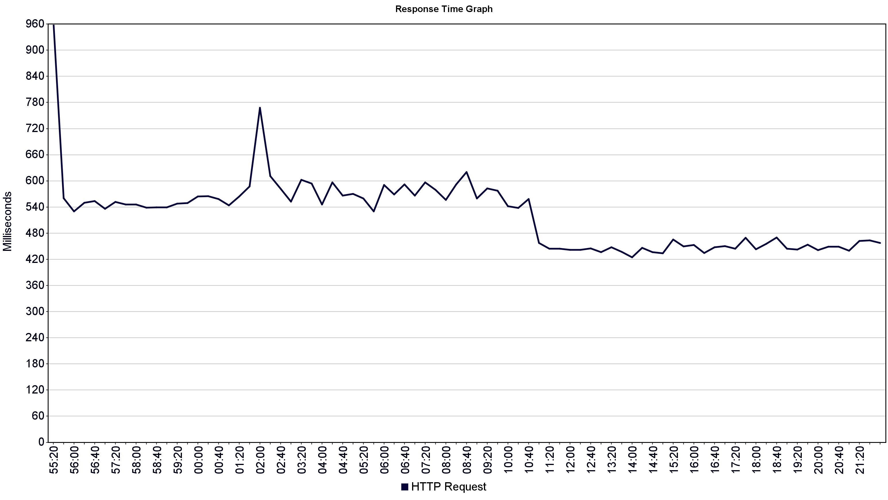

# Labo 03: Auto Scaling an app on Amazon Web Services
In this document we will discuss the observations we made about the auto scaling mechanisms in AWS.

Firstly, we attached our already existing load balancer to an autoscaling group that we created in AWS. I this autoscaling group we added 2 dynamic scaling policies based on 2 AWS cloud watch alarms:

1. When the CPU charge exceeds 30%, launch a new EC2 instance
2. When the charge drops below 10%, terminate an EC2 instance

Once the work donw, we used Jmeter to send requests to the load balancer to induce a high CPU charge. Sent 150 HTTP requests in a loop for approximately 30 minutes (with the same session for each request). Here are our observations:

## AWS cloud watch dashboard

We created an new dashboard in CloudWatch to observe various metrics of our infrastructure. Creating a dashboard allowed us to frow colored horizontal and vertical line in addition to be able to stack and resize multiple graphs on the same page.

The ActiveConnectionCount graph represents the number of active connections on the load balancer:
Region: us-east-1 • ApplicationELB • ActiveConnectionCount • LoadBalancer: app/GrU-VanHove-LoadBalancer.

The CPUUtilization graph is actually the CPU load distributed on our autoScaling Group: 
Region: us-east-1 • EC2 • CPUUtilization • AutoScalingGroupName: GrU_VanHove

The GroupInServiceInstances graph shows the number of instances that are currently in service in our scaling group:
Region: us-east-1 • Auto Scaling • GroupInServiceInstances • AutoScalingGroupName: GrU_VanHove

We can see that the connection count corresponds to the 150 connections that we set in JMeter. We started our test at 07:55 and finished it at 08:21. We added two vertical lines: the first one when the CPU load exceeded 30%, and the second one when the CPU load dropped below 10%.

We can see that 10 minutes after our CPU load exceeded 30%, a new instance was launched. Then, 10 minutes after the first, while the CPU load was still just above 30%, a second one was launched.

Our CPU load dropped below 10% at 08:19. Ten minutes later, one instance was terminated, and the second one was terminated 10 minutes after that.

The main reason why we can see those 10 minutes delay is that we set a cooldown of 300 seconds in our autoscaling group, which specifies the amount of time that the autoscaling group should wait before launching or terminating additional instances. In addition, there is 300 seconds before allowing another scaling activity in our scaling policies. 

We should note that the resolution of the first two graphs is 5 minutes, and the resolution of the last one is 1 minute. We had to set those values; otherwise, we only obtained partial graphs with cut segments (we don't really know why). This is the reason why we see a ramp at the beginning and the end of the tests in the ActiveConnectionCount graph.

## Jmeter response time graph

We can see in the JMeter graph above that at 8:02 we have a peak. This time corresponds to the launch of the first new instance. There can be several reasons why the response time of HTTP requests increased after the first instance was launched. One possible reason is that the newly launched instance may take some time to fully initialize and become available to handle incoming requests. During this period, the load balancer may direct some of the incoming requests to the first instance, resulting in increased response time.

At 08:11, we can see that the response time decreased noticeably. This time corresponds to the second launched instance.

## conclusion

Based on the analysis of the CloudWatch dashboard and Jmeter response time graph, we can conclude that our autoscaling group is working correctly, as it scaled up the number of instances in response to increased CPU load, and scaled down when the load decreased. The delay in the activation of new instances is due to the cooldown period that we have set, which specifies the amount of time that the autoscaling group should wait before launching or terminating additional instances. Additionally, the increased response time after the launch of new instances may be due to the time required for the new instances to fully initialize and become available to handle incoming requests. Overall, by monitoring and analyzing our infrastructure with CloudWatch and Jmeter, we can optimize our autoscaling group to provide a better experience for our users.
